# Xbox Elite 2 Controller Troubleshooting Sequence

## Problem Statement
Xbox Elite 2 controller connects via Bluetooth but only registers partial inputs (D-pad, X button), while Xbox One controller works perfectly on Ubuntu 24.04 with xpadneo driver.

## Troubleshooting Flow

```mermaid
sequenceDiagram
    participant U as User
    participant S as Support
    participant Sys as System

    S->>U: Let's start with basic driver verification. Run: `lsmod | grep hid_xpadneo`
    U->>Sys: Execute command

    alt Module loaded
        Sys-->>U: hid_xpadneo listed
        S->>U: Good! Now check version: `dkms status hid-xpadneo`
        U->>Sys: Check DKMS status

        alt Version >= 0.9.5
            Sys-->>U: Recent version installed
            S->>U: Connect Elite 2 via USB cable first. Does it work fully?

            alt USB works perfectly
                U-->>S: All inputs register via USB
                S->>U: This confirms Bluetooth-specific issue. Run: `sudo btmon` then connect via BT
                U->>Sys: Monitor Bluetooth traffic
                S->>U: Look for HID descriptor differences. Share the btmon output when Elite 2 connects
                U-->>S: Provides btmon logs

                alt HID descriptor shows quirks
                    S->>U: Elite 2 needs custom udev rule. Create: `/etc/udev/rules.d/99-xbox-elite2.rules`
                    S->>U: Add rule: `KERNEL=="hidraw*", ATTRS{idVendor}=="045e", ATTRS{idProduct}=="0b22", MODE="0666"`
                    U->>Sys: Create udev rule
                    S->>U: Reload rules: `sudo udevadm control --reload && sudo udevadm trigger`
                    U->>Sys: Reload udev
                    S->>U: Reconnect controller. Test all inputs now.

                    alt Still partial inputs
                        U-->>S: Same issue persists
                        S->>U: Try xpadneo parameter: `echo 'options hid_xpadneo quirks=0x0001' | sudo tee /etc/modprobe.d/xpadneo.conf`
                        U->>Sys: Add module parameter
                        S->>U: Reload module: `sudo modprobe -r hid_xpadneo && sudo modprobe hid_xpadneo`
                        U->>Sys: Reload module

                        alt Fixed
                            U-->>S: All inputs working!
                            S->>U: ✅ Resolution: Elite 2 needed quirks parameter for proper HID parsing
                        else Still broken
                            U-->>S: Issue remains
                            S->>U: This requires kernel debugging. Check xpadneo GitHub issues for Elite 2 specific patches
                            S->>U: 🔧 Escalation: Hardware-specific HID descriptor incompatibility
                        end
                    else Fixed
                        U-->>S: All inputs working!
                        S->>U: ✅ Resolution: Elite 2 needed custom udev rule for device permissions
                    end
                else Normal HID descriptor
                    S->>U: Descriptor looks normal. Check firmware: Go to Xbox Accessories app on Windows/Xbox
                    U-->>S: No Windows access available
                    S->>U: Try different BT pairing: `sudo bluetoothctl remove [MAC]` then re-pair
                    U->>Sys: Remove and re-pair

                    alt Re-pairing fixed it
                        U-->>S: All inputs working after re-pair!
                        S->>U: ✅ Resolution: Bluetooth pairing corruption resolved
                    else Still broken
                        U-->>S: Same partial input issue
                        S->>U: Test with different kernel: `uname -r` and try mainline kernel if possible
                        S->>U: 🔧 Escalation: Kernel/driver compatibility issue requiring updated kernel
                    end
                end
            else USB also partial
                U-->>S: Same limited inputs via USB
                S->>U: Hardware issue likely. Try controller on different device (Windows PC/Xbox)

                alt Works on other devices
                    U-->>S: Controller fully functional elsewhere
                    S->>U: Linux driver compatibility issue. Check: `cat /sys/kernel/debug/hid/*/rdesc` for your controller
                    S->>U: 🔧 Escalation: Driver needs update for Elite 2 HID descriptor support
                else Doesn't work elsewhere
                    U-->>S: Controller has same issues on all devices
                    S->>U: 🔧 Hardware failure: Controller needs repair/replacement
                end
            end
        else Old version
            Sys-->>U: Version < 0.9.5
            S->>U: Update xpadneo: `cd /usr/src/xpadneo && git pull && sudo make install`
            U->>Sys: Update driver
            S->>U: Reboot and test Elite 2 again

            alt Update fixed it
                U-->>S: All inputs working!
                S->>U: ✅ Resolution: Driver update resolved Elite 2 compatibility
            else Still broken
                U-->>S: Same issue after update
                S->>U: Continue with USB testing (jump to USB test above)
            end
        end
    else Module not loaded
        Sys-->>U: No hid_xpadneo found
        S->>U: Driver not loaded. Check installation: `ls /usr/src/ | grep xpadneo`

        alt xpadneo directory exists
            U-->>S: xpadneo source found
            S->>U: Load module manually: `sudo modprobe hid_xpadneo`
            U->>Sys: Load module

            alt Module loads successfully
                Sys-->>U: Module loaded
                S->>U: Add to auto-load: `echo 'hid_xpadneo' | sudo tee -a /etc/modules`
                S->>U: Now test Elite 2 controller connection
            else Module fails to load
                Sys-->>U: Error loading module
                S->>U: Rebuild driver: `cd /usr/src/xpadneo && sudo make install`
                S->>U: 🔧 May need kernel headers: `sudo apt install linux-headers-$(uname -r)`
            end
        else No xpadneo directory
            U-->>S: No xpadneo installation found
            S->>U: Driver not installed. Run your Ansible playbook: `ansible-playbook -i inventory playbook.yml --tags=controllers`
            S->>U: This will install xpadneo from your tasks/controllers.yml
        end
    end

    Note over S,U: Decision tree terminates at ✅ Resolution or 🔧 Escalation points
```



## Key Decision Points

1. **Driver Status**: Foundation check - without xpadneo, Elite 2 won't work properly
2. **USB vs Bluetooth**: Isolates whether issue is Bluetooth-specific or universal
3. **Firmware/Hardware**: Determines if controller itself is faulty
4. **Version Check**: Older xpadneo versions lack Elite 2 support
5. **Advanced Parameters**: Hardware-specific quirks for Elite 2 HID parsing

## Resolution Categories

- **✅ Quick Fixes**: Driver reload, re-pairing, version update
- **✅ Configuration**: udev rules, module parameters
- **🔧 Escalation**: Hardware failure, kernel incompatibility, driver bugs

## Commands Reference

```bash
# Driver verification
lsmod | grep hid_xpadneo
dkms status hid-xpadneo

# Bluetooth monitoring
sudo btmon

# Module management
sudo modprobe -r hid_xpadneo
sudo modprobe hid_xpadneo

# Bluetooth management
sudo bluetoothctl remove [MAC_ADDRESS]
sudo bluetoothctl pair [MAC_ADDRESS]

# udev rule creation
sudo nano /etc/udev/rules.d/99-xbox-elite2.rules
sudo udevadm control --reload
sudo udevadm trigger
```

### When swapping between different Xbox controllers

Occasionally the permissions on the Elite 2's HID device revert to `0600`, which prevents Proton/SDL titles from detecting the controller even though `evtest` still sees input. If that happens:

1. Ensure the udev rule includes the Elite 2 and Series controller IDs:

   ```bash
   sudo tee /etc/udev/rules.d/99-xbox-elite2.rules <<'EOF'
   SUBSYSTEM=="hidraw", KERNELS=="0005:045E:02FD.*", MODE="0666", TAG+="uaccess"
   SUBSYSTEM=="hidraw", KERNELS=="0005:045E:0B22.*", MODE="0666", TAG+="uaccess"
   EOF
   sudo udevadm control --reload
   sudo udevadm trigger --subsystem-match=hidraw
   ```

2. Power-cycle the controller or toggle Bluetooth off/on, then verify `ls -l /dev/hidraw*` shows the Elite 2 node as `crw-rw-rw-`.
